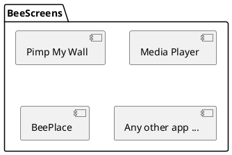

# BeePlace - Recréer l'expérience collaborative du r/place de Reddit

Travail de Bachelor de Valentin Kaelin

24.08.2023

---

# Sommaire

 

- Contexte
- Problèmes à résoudre
- Solutions
- Conclusion
- Perspectives futures

---
layout: cover
background: baleinev-2023.png
---

# Contexte

---
layout: two-cols 
---

# Baleinev Festival

Association Baleinev

* À la HEIG-VD
* Festival de musique depuis près de 30 ans
* Nouveau concept depuis 2014 : Pimp My Wall
  * Application de dessin collaboratif

::right::

Crédits: Antoine Kaelin

<!-- 
Permet aux festivaliers de dessiner en temps réel sur les murs de l'école.

Collaboration

Site donc accessible depuis leur smartphone

Utilisation d'écrans / de projecteurs.

 -->

---
layout: two-cols 
---

# BeeScreens

Depuis 2018

* Nouvelle version open source
* Collection d'applications interactives
  * Faciliter l'ajout de nouvelles applications
* Cadre pouvant sortir du festival

::right::

<!--
Volonté d'utiliser des technologies modernes

Ajout d'une nouvelle app le plus simple possible -> idée de ce TB

-->

---
layout: two-cols
---

# r/place

reddit.com

* Concept proposé par Reddit
* Toile partagée
* 1 pixel par personne toutes les 5 minutes
* Encourage la collaboration

::right::

Résultat du r/place de 2022

<!--
Reddit: plus grand forum au monde

r/place en 2017 puis 2022 et récemment 2023 (mois passé)

Utilisateurs peuvent choisir la couleur
-->

---
layout: cover
background: baleinev-2023.png
---

# Problèmes à résoudre

---
layout: two-cols
---

# 1. Liberté de Pimp My Wall

* Débordements en fin de soirée (oeuvres inappropriées)
* Modération difficile et chronophage

 

**Solutions:**

* Concept du r/place
* Temps d'attente entre chaque pixel
  * Besoin d'identifier les utilisateurs
* Modération plus efficace

::right::

<!--
Même si l'utilisateur veut dessiner qqch d'inapproprié, cela lui prend du temps.

Si on modère, il perd son temps et doit tout recommencer.
-->

---

# 2. Montée en charge

TODO

