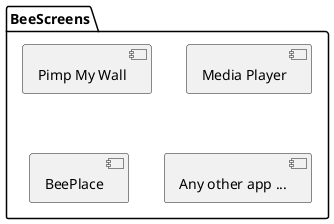

# Soutenance du TB

BeePlace - Recréer l'expérience collaborative du r/place de Reddit

<footer class="flex items-center justify-between w-full absolute left-0 bottom-0">
  Valentin Kaelin
  24.08.2023
</footer>

---
layout: two-cols
---

# Sommaire

 

- Contexte
- Problèmes à résoudre
- Solutions
- Conclusion

::right::

---
layout: cover
background: baleinev-2023.png
---

# Contexte

---
layout: two-cols 
---

# Baleinev Festival

Association Baleinev

* À la HEIG-VD
* Festival de musique depuis près de 30 ans
* Nouveau concept depuis 2014 : Pimp My Wall
  * Application de dessin collaboratif

::right::

Crédits: Antoine Kaelin

<!-- 
Permet aux festivaliers de dessiner en temps réel sur les murs de l'école.

Collaboration

Site donc accessible depuis leur smartphone

Utilisation d'écrans / de projecteurs.

 -->

---
layout: two-cols 
---

# BeeScreens

Depuis 2018

 
 

* Nouvelle version open source
* Collection d'applications interactives
  * Faciliter l'ajout de nouvelles applications
* Cadre pouvant sortir du festival

::right::

<!--
Volonté d'utiliser des technologies modernes

Ajout d'une nouvelle app le plus simple possible -> idée de ce TB
-->

---
layout: two-cols
---

# r/place

reddit.com

 
 

* Concept proposé par Reddit
* Toile partagée
* 1 pixel par personne toutes les 5 minutes
* Encourage la collaboration

::right::

Résultat du r/place de 2022

<!--
Reddit: plus grand forum au monde

r/place en 2017 puis 2022 et récemment 2023 (mois passé)

Utilisateurs peuvent choisir la couleur
-->

---
layout: cover
background: baleinev-2023.png
---

# Problèmes à résoudre

---
layout: two-cols
---

# 1. Liberté de Pimp My Wall

 

* Débordements en fin de soirée (oeuvres inappropriées)
* Modération difficile et chronophage

 

**Solutions:**

* Concept du r/place
* Temps d'attente entre chaque pixel
  * Besoin d'identifier les utilisateurs
* Modération plus efficace

::right::

<!--
Même si l'utilisateur veut dessiner qqch d'inapproprié, cela lui prend du temps.

Si on modère, il perd son temps et doit tout recommencer.
-->

---
layout: two-cols
---

# 2. Application web

Contraintes externes

 

* Utilisée principalement sur smartphone
* Optimisation pour ce médium
* (Taille écran, utilisation tactile, etc.)

 
 

* Diffusion sur les murs de l'école
* Mode affichage nécessaire
* Séparer l'affichage entre plusieurs écrans

::right::

---
layout: two-cols
---

# 3. Montée en charge

 
 

* Assurer la scalabilité
* Pouvoir gérer un nombre élevé d'utilisateurs simultanés:
  * Pics de fréquentation lors du festival
* Garder une latence faible (bonne UX)

::right::

<!--
Latence faible: assurer une bonne UX
-->

---
layout: cover
background: baleinev-2023.png
---

# Solutions

---

# Technologies

---
layout: two-cols 
---

# Identification

Pour limiter la fréquence d'ajout de pixels

 

* Plus simple possible pour les festivaliers
* Sans nuire à la fluidité de l'expérience

 

**Solution:**

* Authentification par empreinte digitale (fingerprint)
* Librairie FingerprintJS (open source)

::right::

<!--
Pas possible d'utiliser des comptes classiques: trop long

Même si connexion via Google ou autre réseau
-->

--- 

# Déploiement

TODO

--- 

# Montée en charge

TODO

---
layout: cover
background: baleinev-2023.png
---

# Conclusion

---

# Conclusion technique

TODO

---

# Conclusion personnelle

TODO

---
layout: two-cols
---

# Perspectives futures

 

**Organisation**

* Tests lors du Baleinev 2024
* Lier le monde physique
  * Résoudre les problèmes d'authentification 

 

**Développement**

* Dashboard d'administration
* Statistiques

::right::

<!--
Baleinev 2024 -> BeePlace sur les tours et pas que sur des petits écrans du rez
Plus grande échelle grâce au mode affichage

Lier monde physique: QRCode sur billet ? Ou numéro unique ?

Dashboard admin: faciliter la modération
Ex: sélectionner la zone à modérer

Stats, ex: 
- nb de pixels placés par jour, heure, minute avec des graphiques de l’évolution
— nb de pixels placés par utilisateur
— nb de pixels placés en fonction de sa couleur
— nb de pixels placés par zone, en réalisant une sorte d’"heat map" de la toile
— Analyse des actions de modération, affichage par exemple des oeuvres qui ont dû être
supprimées.
-->

---
layout: cover
background: baleinev-2023.png
---

# Merci de votre attention !
 
Avez-vous des questions ?

---
layout: two-cols
---

# Sources

 
 

* Photos: Antoine Kaelin & Kevin Pradervand
* Illustrations: unDraw

::right::

