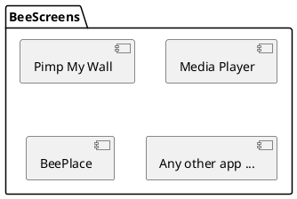

# Soutenance du TB

BeePlace - Recréer l'expérience collaborative du r/place de Reddit

<footer class="flex items-center justify-between w-full absolute left-0 bottom-0">
  Valentin Kaelin
  24.08.2023
</footer>

---
layout: two-cols
---

# Sommaire

 
 

- Contexte
- Problématique
- Solution et contraintes
- Conception et réalisation
- Conclusion
- Démonstration

::right::

---
layout: cover
background: baleinev-2023.png
---

# Contexte

---
layout: image-right
image: pmw.jpg
---

# Baleinev Festival

 

**Association Baleinev**

* À la HEIG-VD
* Festival de musique depuis près de 30 ans

**Pimp My Wall**
* Nouveau concept depuis 2014 : Pimp My Wall
* Application de dessin collaboratif

<!-- 
Permet aux festivaliers de dessiner en temps réel sur les murs de l'école.

Collaboration

Site donc accessible depuis leur smartphone

Utilisation d'écrans / de projecteurs.
-->

---
layout: two-cols 
---

# BeeScreens

 

**Depuis 2018**

* Nouvelle version open source
* Collection d'applications interactives
  * Faciliter l'ajout de nouvelles applications
* Cadre pouvant sortir du festival

::right::

<!--
Volonté d'utiliser des technologies modernes

Ajout d'une nouvelle app le plus simple possible -> idée de ce TB
-->

---
layout: cover
background: baleinev-2023.png
---

# Problématique

---
layout: two-cols
---

# Liberté de Pimp My Wall

 

Débordements en fin de soirée (oeuvres inappropriées)

Modération difficile et chronophage

Affecte les autres utilisateurs: gâche les dessins

 
 

**↳ Expérience frustrante pour nous et les festivaliers**

::right::

<!--
Même si l'utilisateur veut dessiner qqch d'inapproprié, cela lui prend du temps.

Si on modère, il perd son temps et doit tout recommencer.
-->

---
layout: cover
background: baleinev-2023.png
---

# Solution et contraintes

---
layout: two-cols
class: no-subtitle col-padding
---

# Solution

**r/place de Reddit**

Toile partagée par des millions d'utilisateurs

1 pixel par personne toutes les 5 minutes

Encourage la collaboration

Occasionnel pendant une courte période (2017, 2022 et 2023) ⇒ forte rivalité

::right::

Résultat du r/place de 2022

<!--
Solution: s'inspirer du concept de r/place de Reddit

Reddit: plus grand forum au monde

r/place en 2017 puis 2022 et récemment 2023 (mois passé)

Utilisateurs peuvent choisir la couleur parmis une palette définie
-->

---
layout: two-cols
---

# Application web

Contraintes externes

 

* Utilisée principalement sur smartphone
* Optimisation pour ce médium
* (Taille écran, utilisation tactile, etc.)

 
 

* Diffusion sur les murs de l'école
* Mode affichage nécessaire
* Séparer l'affichage entre plusieurs écrans

::right::

Crédits: Kevin Pradervand

---
layout: two-cols
---

# Montée en charge

 
 

* Assurer la scalabilité
* Pouvoir gérer un nombre élevé d'utilisateurs simultanés:
  * Pics de fréquentation lors du festival
* Garder une latence faible (bonne UX)

::right::

<!--
Latence faible: assurer une bonne UX
-->

---
layout: cover
background: baleinev-2023.png
---

# Solutions

---

# Technologies

---
layout: two-cols 
---

# Identification

 

**Pour limiter la fréquence d'ajout de pixels**

* Plus simple possible pour les festivaliers
* Sans nuire à la fluidité de l'expérience

**Solution**

* Authentification par empreinte digitale (fingerprint)
* Librairie FingerprintJS (open source)

**Problèmes**

* Risque de collisions
* Possibilité de bots (générée côté client)

::right::

<!--
Pas possible d'utiliser des comptes classiques: trop long

Même si connexion via Google ou autre réseau

Problème de collisions car librairire free (env 60% d'accuracy), sur un petit dataset aucune collision trouvée (10-20 personnes).
Problème si collision: temps d'attente partagé
Bot: envoyer une fingerprint différente / random à chaque requête

Solution: on verra plus tard dans la conclusions
-->

---
layout: two-cols
---

# Frontend

 

**Next.js**

* Canvas HTML5
* Connexion WebSockets avec Socket.IO
* Stockage de l'état dans un state global
* PinchZoom du canvas
* Mode affichage

 

**Design**
* Utilisation de TailwindCSS

::right::

<!--
State global: Zustand

TailwindCSS: utilitaire de classes CSS (design system)
Pas bcp de design à faire donc tout custom
-->

---
layout: two-cols
class: no-subtitle
---

# Backend

**Nest.js**

* Architecture DDD
* ORM Prisma (PostgreSQL)
* Configuration par variables d'environnement

**Administration**

* Endpoints HTTP protégés
* Stratégie d'API Key
* Actions:
  * Read only
  * Remise à zéro de la toile
  * Recouvrir une zone de pixels

::right::

<!---
DDD: Domain Driven Design, découpage par domaine
ORM: Object Relational Mapping, permet de manipuler la base de données comme des objets

Config: env var avant le futur dashboard
Exs: taille du canvas, couleurs, nombre de pixels que l'utilisateur peut poser, etc.
-->

---
layout: two-cols 
---

# Stockage

 
 

**3 niveaux de stockage:**

1. Dans la mémoire de l'application
2. Bitfield Redis
3. Base de données PostgreSQL

::right::

Structure du Bitfield Redis:

Crédits: Daniel Ellis (Reddit)

Structure SQL:

<!--

Bitfield Redis: parler du schéma

Pourquoi aussi en mémoire ? Profling: bitfield (string) -> tableau JS couteux

=> Redis utilisé lorsque l'app redémarre ou que l'on change la config

Base de données SQL pas encore utilisée, que pour l'historique de tous les pixels.
Pour de futures statistiques, j'en parlerai dans les perspectives futures
-->

<!-- TODO: voir si un slide sur le package est nécessaire ici -->

<!-- ---

# Déploiement

TODO -->

---
layout: two-cols 
---

# Montée en charge

  <strong>Outils utilisés</strong>
  

    
    
  

* k6 pour les tests de montée en charge
* Clinic.js pour le profiling
  * Graphiques en flammes

 

**Résultats initiaux des tests**

* Utilisateurs virtuels : **558**
* Pixels dessinés : **1017**

::right::

<!--
Déployée sur une seconde VM de l'école pour les tests

k6: permet de créer des tests en JS/TS
Pas possible d'utiliser Socket.IO de base => module créé

Breakpoint Test: crée des users virtuels qui se connectent et dessinent sur la toile (3 pixels chacun)
Jusqu'à ce que la latence soit supérieure à 1.2s

Clinic.js: plusieurs outils dispos mais utilisé le flame pour le profiling

Faut lancer clinic puis lancer l'app, lancer les tests et ensuite stopper l'app pour avoir le graph
-->

---
layout: two-cols
---

# Optimisations

 

* Broadcast des pixels avec un intervalle de temps
* Format plus léger pour l'envoi des pixels
* Cache du Bitfield Redis en mémoire
* Configuration de l'OS Linux

 

**Résultats finaux**

* Utilisateurs virtuels : **1348.5** (+ 141.67%)
* Pixels dessinés : **3078.5** (+ 202.70%)

::right::

<!--
— Optimisation du broadcast des pixels avec un intervalle de temps ;
— Utilisation d’un format sous forme de chaîne de caractères plus léger que le JSON pour
envoyer les pixels ;
— Mise en cache du Bitfield Redis dans la mémoire de l’application ;
— Installation de dépendances optionnelles pour Socket.IO permettant d’accélérer certaines
opérations ;
— Optimisation de la configuration du système d’exploitation Linux (nombre maximal de
fichiers ouverts en simultané).
-->

---
layout: cover
background: baleinev-2023.png
---

# Conclusion

---
layout: two-cols
class: no-subtitle
---

# Conclusion technique

**Cahier des charges**

✅ Fonctionnalités _required_ et _essential_

✅ Moitié des fonctionnalités _nice to have_

✅ Fonctionnalités non prévues

 

**Objectifs accomplis (Baleinev 2023)**

* Moins de débordements
* Plus de collaboration
* Expérience plus positive que Pimp My Wall

::right::

**Retour d'expérience**

* Application fonctionnelle et déployée
* Technologies bien choisies, aucun réel blocage
* Optimisations concluantes, permet de tenir tous les festivaliers 🕺💃
* Apprentissages utiles pour le futur

**Améliorations possibles**

* Accessibilité de l'app:
  * Tutoriel, textes informatifs
  * Internationalisation
* Tests unitaires et d'intégration

<!--
Objectifs vérifiés: grâce au test réalisé lors du Baleinev 2023

Fonctionnalités non prévues:
  - Mode affichage plus poussé
  - Package pour partager le code
  - Historique dans la base de données SQL

Apprentissages:
  - Surtout aspect tests de montée en charge, profiling, et optimisation
  - k6 bon outil à connaître, bcp utilisé
-->
---
layout: two-cols
class: no-subtitle
---

# Conclusion personnelle

**Technique**

* Projet qui me tient à coeur
* Bénéfices de réaliser un projet plus long et conséquent
* Retours lors du Baleinev Festival 2023 encourageants

**Organisationnel**

* Travail seul sur un projet mais au sein d'une équipe 
* Review du code bénéfique, permet d'améliorer la qualité
* Bonnes pratiques du monde professionnel (daily meeting, sprint review, ...)

::right::

<!--
Chance d'avoir travaillé sur un projet qui me passionne, c'était un plaisir d'ajouter petits à petits des fonctionnalités.

-->

---
layout: two-cols
class: col-padding
---

# Perspectives futures

 

**Organisation**

* Tests lors du Baleinev 2024
* Lier le monde physique pour résoudre les problèmes d'authentification

 

**Développement**

* Dashboard d'administration
* Statistiques
* Toile rectangulaire

::right::

<!--
Baleinev 2024 -> BeePlace sur les tours et pas que sur des petits écrans du rez
Plus grande échelle grâce au mode affichage

Lier monde physique: QRCode sur billet ? Ou numéro unique ?
Autre idée d’auth: borne de pixels, QR code à scanner qui te file une session de X minutes

Dashboard admin: faciliter la modération
Ex: sélectionner la zone à modérer

Stats, ex: 
- nb de pixels placés par jour, heure, minute avec des graphiques de l’évolution
— nb de pixels placés par utilisateur
— nb de pixels placés en fonction de sa couleur
— nb de pixels placés par zone, en réalisant une sorte d’"heat map" de la toile
— Analyse des actions de modération, affichage par exemple des oeuvres qui ont dû être
supprimées.
-->

---
layout: iframe-right
url: https://place.beescreens.ch/
---

# Démonstration

 

À vos pixels !

[place.beescreens.ch](https://place.beescreens.ch)

---
layout: cover
background: baleinev-2023.png
---

# Merci de votre attention !
 
Avez-vous des questions ?

---
layout: two-cols
---

# Sources

 
 

* Photos: Antoine Kaelin & Kevin Pradervand
* Illustrations: unDraw

::right::

---
layout: cover
background: baleinev-2023.png
---

# Annexes

---
layout: image
image: appendix/display-mode-config.png
---

---
layout: image
image: appendix/display-mode-example.png
---

---
layout: two-cols
---

::right::

